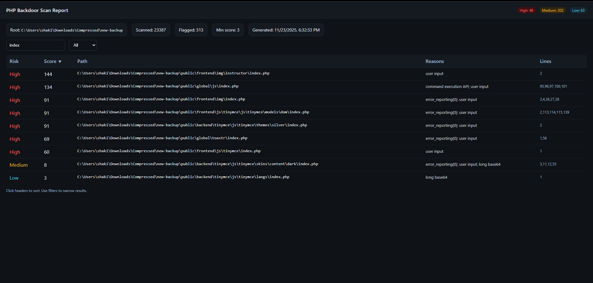
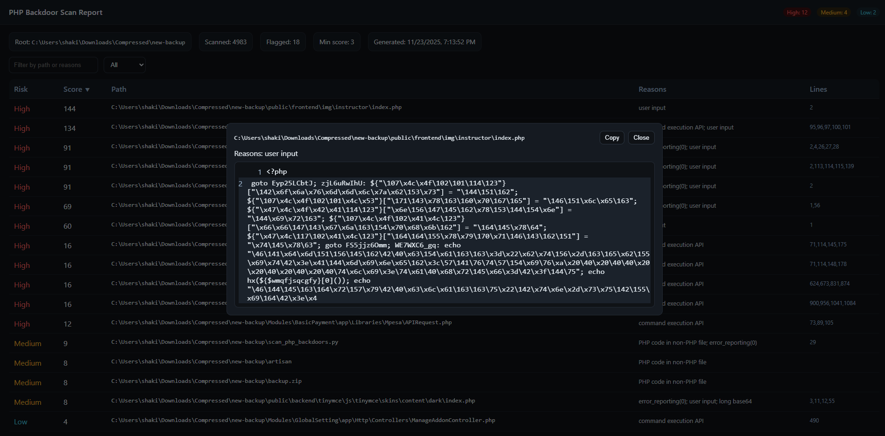

# Backdoor Finder (PHP)

A fast, zero-dependency scanner for suspicious PHP code and common backdoor patterns. It walks a directory tree, scores files by risk, and produces an interactive HTML report with sortable columns, filters, and inline code snippets.



## Highlights

- Scans both PHP files and any file containing `<?php` (even non-PHP extensions)
- Heuristic scoring with risk levels: High, Medium, Low
- Detects obfuscation and dangerous constructs (e.g., `eval(base64_decode)`, `gzinflate`, remote includes)
- Flags PHP in unexpected places and binary headers in `.php` files
- Generates an interactive HTML report and optional JSON output
- Shows progress bar and ETA while scanning
- Skips common vendor code by default via `IGNORE_DIRS` (includes `vendor`)

## Requirements

- Python 3.10+ (uses modern type hints)
- No external libraries required

On Windows, use `py -3`. On macOS/Linux, use `python3`.

## Usage

Basic usage:

```bash
py -3 scan_php_backdoors.py C:\path\to\webroot
```

Common options:

- `--min-score <int>`: minimum score to include in results (default: `3`)
- `--html <path>`: output HTML file path (default: `report.html`)
- `--write-json`: also write `report.json` next to the HTML
- `--open`: open the HTML report after generation (Windows only)

Examples:

```bash
# Windows: scan and open report, include Medium/High (>=6)
py -3 scan_php_backdoors.py C:\Sites\myapp --min-score 6 --open

# macOS/Linux: stricter threshold, custom HTML name, also write JSON
python3 scan_php_backdoors.py /var/www/html --min-score 8 --html ./out/report.html --write-json
```

Output:

- Prints a table summary in the terminal
- Writes an interactive HTML report (`report.html` by default)
- Optionally writes a JSON payload (`report.json`) when `--write-json` is set



## What It Detects

The scanner scores files based on multiple signals:

- Dangerous constructs
  - `eval(base64_decode(...))`
  - `gzinflate(base64_decode(...))`
  - `preg_replace` with `/e` modifier
  - Remote include/require via `http(s)://`
  - `assert($_GET|$_POST|$_REQUEST|$_COOKIE[...])`
  - Command execution APIs: `shell_exec`, `system`, `passthru`, `exec`, `popen`, `proc_open`
- Obfuscation and stealth
  - `base64_decode(str_rot13(...))`
  - `str_rot13(...)`
  - `create_function(...)`
  - `error_reporting(0)`
  - Long `chr(...)` chains
  - Very long base64 blobs
  - `eval` of decoded variables
- Context anomalies
  - Binary file headers inside `.php`
  - PHP code found in non-PHP files

Risk levels are assigned from the cumulative score:

- `High` when score ≥ 10
- `Medium` when score ≥ 6
- `Low` when score ≥ 3

## File Types

- PHP extensions scanned by default: `.php`, `.phtml`, `.php5`, `.php7`, `.inc`
- Non-PHP files are also scanned when they contain `<?php`

## Reports

- The HTML report supports:
  - Sorting by Risk, Score, Path, Reasons, Lines
  - Filtering by risk level and text search
  - Clicking a row opens a modal with an inline code snippet around the flagged line(s)

### JSON Structure

When `--write-json` is used, a JSON file is written next to the HTML. It includes:

- `meta`: root path, file counts, thresholds, timestamp
- `results`: entries with `path`, `score`, `risk`, `reasons`, `lines`, and snippet info

## Ignoring Folders

By default, the scanner skips files inside directories listed in `IGNORE_DIRS`.

- Default: `{"vendor"}`
- Location: top of `scan_php_backdoors.py`

To ignore additional folders, edit the set. Example:

```python
IGNORE_DIRS = {"vendor", "storage", "node_modules"}
```

Directory names are matched case-insensitively against path segments.

## Tips

- Start with a higher threshold (e.g., `--min-score 6`) to focus on likely issues
- Review flagged files manually; heuristics can produce false positives
- Scan backups or archives extracted offline to avoid touching live systems
- Keep `vendor` ignored unless you suspect supply-chain compromise

## Limitations

- Regex-based detection; no full PHP parsing or control-flow analysis
- Heuristics may miss novel backdoors or flag benign code
- Very large repositories may take time to scan; use ignores to speed up

## License

MIT
